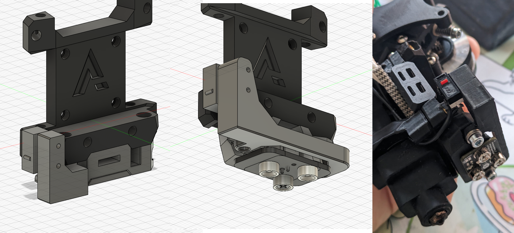
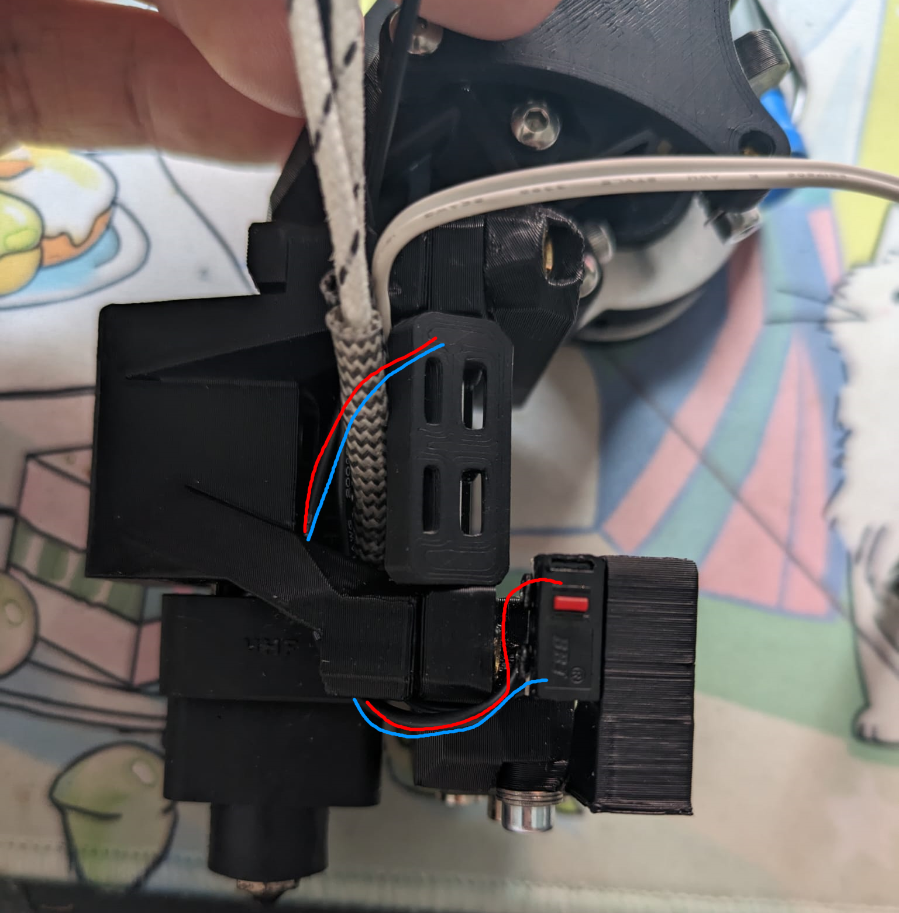

# Archetype_xendstops

These are two X endstop mounts for the armchair engineering archetype toolhead system (https://github.com/Armchair-Engineering/Archetype/tree/main). 
Instead of mounting on the location where the washers clamp the underside of the mgn12 block, they mount to the probe block. Its also available as a replacement probe spacer.

Its compatible with:
- all lengths of klicky
- all lenghts of klickyPCB
- all lengths of euclid.
No beacon unfortunately, except with the spacer. (although no guarantees if that would work either, i have no idea how beacon works)

The probe spacer has an integrated support block due to the required printing orientation. The endstop mount should stick out upwards.

I havent run it in an actual printer yet but the test prints seem to work well for me. Let me know if you have any issues :)

# Instructions

Solder your two wire leads at a 90 degree angle so they come out to the front.
Run these wires down, back up through the inside of the hotend mount, and then out again along your thermistor and heater wires to wherever.
The probe mount uses two m3x18 instead of m3x16. M3x20 with some washers works well too (the probe mount is 3mm thick). The spacer mounts however it usually does.

